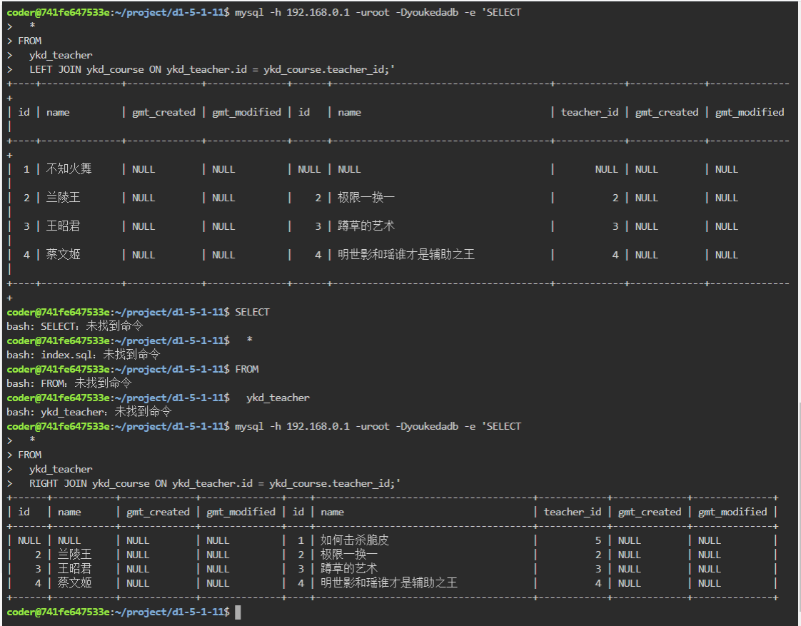

#第五章 MySQL关联查询
##5.1左连接
经典的关系数据库设计需要符合范式要求

不同的数据如何用表联系起来？工地扬尘系统中环境数据，控制电机的数据，百度地图显示的数据，工地id号如何联系起来？

**答：应该创建三张表(分别为“环境数据”，“控制电机的数据”，“百度地图显示的数据”)**

**就像创建学生，老师，课程三个类，而不是去创建课程这个类，含有老师，学生等一系列的属性**


这种多表数据记录关联查询，简称**关联查询**

关联查询有很多种，常见的有左连接，右连接，内连接等

###语法
```
SELECT
  *
FROM
  TableA LEFT  JOIN
  TableB
  ON condition;
```
<ul>
<li>JOIN 是关联查询的关键词，基础的结构是 TableA JOIN TableB，即表 A 和表 B 关联查询，LEFT 表示是左连接</li>
<li>ON 是关联查询的条件，接下来我们会讲到</li>
<li>左连接就是返回左表的所有数据，即使右表没有匹配的数据（此时右表会以 NULL 的形式匹配数据）。</li>
</ul>

例子需要关联查询ykd_teacher和ykd_course两张表，假设ykd_teacher为左表，左连接查询，查询条件为ykd_teacher表的主键和ykd_course表中的teacher_id字段
```
SELECT
  *
FROM
  ykd_teacher
  LEFT JOIN ykd_course ON ykd_teacher.id = ykd_course.teacher_id;
```

<ul>
<li>ykd_teacher 是表 A，ykd_course 是表 B</li>
<li>ykd_teacher.id 是指这张表的 id 字段，同理 ykd_course.teacher_id 是指这张表的 teacher_id 这个字段</li>
<li>我们的查询条件，让上面 2 个字段相等并匹配</li>
</ul>


###表结构设计规范

<p>我们在数据库给大家内置了三张表格：ykd_student,ykd_course,ykd_teacher:</p>
<blockquote>
<p>在实际的应用中，学生表之外还有班级表和年级表，大学还会有专业表，这里为了简化，我们假设的场景是门派式的，一个长老（老师）负责教一门课，学生之间都是内门弟子，没有多余的概念（其实是为了偷懒哈哈）。</p>
</blockquote>
<table>
<thead>
<tr>
<th>id</th>
<th>name</th>
<th>birthday</th>
<th>course_id</th>
<th>gender</th>
<th>gmt_created</th>
<th>gmt_modified</th>
</tr>
</thead>
<tbody><tr>
<td>1</td>
<td>孙悟空</td>
<td>公元前 578 年六月初一</td>
<td>1</td>
<td>男</td>
<td>NULL</td>
<td>NULL</td>
</tr>
<tr>
<td>2</td>
<td>刘备</td>
<td>公元 161 年 7 月 16 日</td>
<td>3</td>
<td>男</td>
<td>NULL</td>
<td>NULL</td>
</tr>
<tr>
<td>3</td>
<td>妲己</td>
<td>公元前 1076 年七月初三</td>
<td>4</td>
<td>女</td>
<td>NULL</td>
<td>NULL</td>
</tr>
<tr>
<td>4</td>
<td>鲁班七号</td>
<td>公元 2016 年 11 月 26 日</td>
<td>2</td>
<td>男</td>
<td>NULL</td>
<td>NULL</td>
</tr>
</tbody></table>
<table>
<thead>
<tr>
<th>id</th>
<th>name</th>
<th>teacher_id</th>
<th>gmt_created</th>
<th>gmt_modified</th>
</tr>
</thead>
<tbody><tr>
<td>1</td>
<td>如何击杀脆皮</td>
<td>1</td>
<td>NULL</td>
<td>NULL</td>
</tr>
<tr>
<td>2</td>
<td>极限一换一</td>
<td>2</td>
<td>NULL</td>
<td>NULL</td>
</tr>
<tr>
<td>3</td>
<td>蹲草的艺术</td>
<td>3</td>
<td>NULL</td>
<td>NULL</td>
</tr>
<tr>
<td>4</td>
<td>瑶和明世隐谁才是辅助之王</td>
<td>4</td>
<td>NULL</td>
<td>NULL</td>
</tr>
</tbody></table>
<table>
<thead>
<tr>
<th>id</th>
<th>name</th>
<th>gmt_created</th>
<th>gmt_modified</th>
</tr>
</thead>
<tbody><tr>
<td>1</td>
<td>不知火舞</td>
<td>NULL</td>
<td>NULL</td>
</tr>
<tr>
<td>2</td>
<td>兰陵王</td>
<td>NULL</td>
<td>NULL</td>
</tr>
<tr>
<td>3</td>
<td>王昭君</td>
<td>NULL</td>
<td>NULL</td>
</tr>
<tr>
<td>4</td>
<td>蔡文姬</td>
<td>NULL</td>
<td>NULL</td>
</tr>
</tbody></table>

<ol>
<li>表必须要有主键。</li>
<li>一个字段只表示一个含义。</li>
<li>总是包含两个日期字段:gmt_created(创建日期),gmt_modified(修改日期)，且这两个字段不应该包含有额外的业务逻辑。</li>
<li>MySQL 中，gmt_created、gmt_modified 使用 DATETIME 类型。</li>
<li>禁止使用复杂数据类型（数组，自定义类型等）。</li>
<li>禁止使用物理外键，使用逻辑外键</li>
<li>禁止物理删除，使用逻辑删除 is_deleted</li>
</ol>

<blockquote>
<p>逻辑删除（英语：logical deletion），又被称软删除、假删除，是一种数据库操作，使用标记将数据标为不可用，而不从数据库删除数据本身。使用适当的方法可恢复被删除的数据。在商业公司的实际开发中会使用，本课程暂不涉及。</p>
</blockquote>

<p>其中第 6 点，例如表 b 记录了表 a 的 id，我们只需在表 b 中添加一列：a_id 就可以了，然后通过程序来控制外键关系,这就是逻辑外键。在 MySQL 中，我们通过这样的方式去关联两张表。</p>

<blockquote>
<p>初学者很容易把 ykd_teacher 的主键也命名成 teacher_id，这是一种不规范的行为，teacher_id 这个字段是指去关联 ykd_teacher 这张表中的主键。对于 ykd_teacher 本身而言，它叫 id 就可以了，尽量避免在 ykd_teacher 表中出现 ykd_teacher_name 这样的字段。</p>
</blockquote>

```
SELECT
  ykd_student.id,
  ykd_student.name,
  ykd_student.birthday,
  ykd_student.course_id,
  ykd_student.gender,
  ykd_course.id,
  ykd_course.name
FROM
  ykd_student
  LEFT JOIN ykd_course ON ykd_student.course_id = ykd_course.id;
```
**不同的表关联查询的时候SELECT内容要指定字段**


##5.2右连接
###语法
```
SELECT
  *
FROM
  TableA RIGHT JOIN 
  TableB 
  ON condition;
```
<p>参考上一节的例子，现在我们想用右连接查询课程对应的老师（不管课程有没有对应的老师，都要展示课程信息），那么我们应该这么写SQL：</p>
```
SELECT
  *
FROM
  ykd_teacher
  RIGHT JOIN ykd_course ON ykd_teacher.id = ykd_course.teacher_id;
```

<p>我们可以看到查询的结果因为左连接或者右连接不一致，当左连接时会返回左表的所有数据，当右连接时会返回右表的所有数据。</p>



###多表关联查询
在实际情况中会对三张表以上进行关联查询，一般选用一张表作为主表，以它为基准们进行LEFT JION或RIGHT JOIN查询

###语法
```
SELECT
  *
FROM
  TableA 
  LEFT JOIN TableB ON conditionA
  LEFT JOIN TableC ON conditionB;
```

<p>比如我们对ykd_student,ykd_course,ykd_teacher这三张表进行关联查询，我们的应该这么写SQL:</p>

```
SELECT
  *
FROM
  ykd_course
  LEFT JOIN ykd_student ON ykd_student.course_id = ykd_course.id
  LEFT JOIN ykd_teacher on ykd_course.teacher_id = ykd_teacher.id;
```
A先和B关联，然后再和C进行关联查询


##5.3内连接
左右连接不能满足左右的查询需要，比如我们想查询第二节课中选课了的学生信息，就要用到内连接
###INNER连接
<p>我们在数据库为大家内置了两张表，TABLE_A,TABLE_B：</p>
<table>
<thead>
<tr>
<th>id</th>
<th>name</th>
</tr>
</thead>
<tbody><tr>
<td>1</td>
<td>张三</td>
</tr>
<tr>
<td>2</td>
<td>李四</td>
</tr>
<tr>
<td>3</td>
<td>王五</td>
</tr>
<tr>
<td>4</td>
<td>钱六</td>
</tr>
<tr>
<td>5</td>
<td>七个葫芦娃</td>
</tr>
<tr>
<td>6</td>
<td>八大门派</td>
</tr>
<tr>
<td>7</td>
<td>九九归一</td>
</tr>
<tr>
<td>8</td>
<td>十全十美</td>
</tr>
<tr>
<td>9</td>
<td>及格啦</td>
</tr>
<tr>
<td>10</td>
<td>叶冰</td>
</tr>
<tr>
<td></td>
<td></td>
</tr>
<tr>
<td>id</td>
<td>math</td>
</tr>
<tr>
<td>----</td>
<td>------</td>
</tr>
<tr>
<td>1</td>
<td>40</td>
</tr>
<tr>
<td>2</td>
<td>30</td>
</tr>
<tr>
<td>3</td>
<td>50</td>
</tr>
</tbody></table>
<blockquote>
<p>前面讲到MySQL表格应该包含gmt_created，gmt_modified，这里是为了便于演示，省略了这两个字段。表名也是为了便于演示直接命名为A和B，这都是不规范的行为。
在实际的应用场景中，一张表格不会太复杂，并且会根据字段的不同拆分成多张表，比如说学生成绩表中，有些信息是会变得，比如考试会有很多次，每次的成绩可能不同，而有些信息是基本不变的，比如学生姓名和学生的班级，所以我们会设计学生表和成绩表，然后关联查询得到具体某一场的考试成绩。也就是我们上面的表A和表B。</p>
</blockquote>
<p>现在假设我们是大学某门课的老师，我们需要查询班级A中参与B考试的学生，（A，B同时符合某一个条件的数据），得到的数据是内部共有的数据，所以连接方式称为内链接（INNER JOIN）：</p>
<p></p>
<p>我们可以这么写查询语句：</p>
```
SELECT
  *
FROM
  Table_A
  INNER JOIN Table_B
ON
  Table_A.id = Table_B.student_id;
```
<blockquote>
<p>这里INNER可以省略，只写JOIN，效果是一样的，LEFT JOIN 和 RIGHT JOIN都属于外连接，和内连接对应。</p>
</blockquote>
<p>我们可以看到，表格A中，学生id为1，2的同学参与了B考试，和查询结果符合</p>
<h3 id="外连接的拓展">外连接的拓展</h3>
<p>在前面两节我们学习了外连接，最后查询得到的数据是这样的：</p>
<p></p>
<p>或者是这样的：</p>
<p></p>
<p>在实际的应用中，有时候我们希望查询A中和B完全没有关系的数据，比如我们希望查询班级A中没有参与B考试的人员，类似这样：</p>
<p></p>
<p>结合上面的两张表，我们可以这么写查询语句：</p>

```
SELECT
  *
FROM
  Table_A
  LEFT JOIN Table_B ON Table_A.id = Table_B.student_id
WHERE
  Table_B.student_id IS NULL;
```

<p>我们可以看到，查询得到的结果不包含B表拥有的student_id。</p>
<h3 id="union-关键字">UNION 关键字</h3>
<p>在实际的应用场景中，我们有时候需要联合查询所有的内容，就像下图这样：</p>
<p></p>
<p>比如我们现在想要查询A表中所有的学生和B表中所有的学生，不管他们是否参与了考试，有没有成绩，那么我们应该这样写查询语句：</p>
```
SELECT
  *
FROM
  Table_A
  LEFT JOIN Table_B
ON
  Table_A.id = Table_B.student_id
UNION DISTINCT
SELECT
  *
FROM
  Table_A
  RIGHT JOIN Table_B ON Table_A.id=Table_B.student_id;
```
<blockquote>
<p>这句话相当于同时执行AB表的左右连接。</p>
</blockquote>
<p>UNION关键字可以将两个查询语句的结果合并，并去除重复数据，UNION DISTINCT 和 UNION 的效果一样，所以我们一般直接使用UNION。</p>
<blockquote>
<p>一般来说我们要求查询得到的数据是去重的，在极少数情况下我们需要展示不去重的数据，我们可以把DISTINCT关键词换为ALL关键词。</p>
</blockquote>
<h3 id="笛卡尔积">笛卡尔积</h3>
<p>在实际的应用场景中，有时候还会需要查询可能会出现的结果，这个也就是数学上的笛卡尔积。
假设有表A，包含2条数据，以AB代指，集合B，包含3条数据以abc代指，使用cross join关键词查询，得到的结果会是单纯的乘积，一共2*3=6条数据。</p>
<p>笛卡尔积在MySQL的实际应用中应该是避免的，所以大家只需要知道有这么一个概念，不需要掌握实际的使用。</p>
<blockquote>
<p>在MySQL中INNER JOIN，CROSS JOIN，JOIN都是等价的，一般INNER JOIN配合ON使用，CROSS JOIN配合其他条件使用。我们仅需要知道这个概念就可以辣，在其他的SQL语言中，INNER JOIN 和 CROSS JOIN并不相同。</p>
</blockquote>


